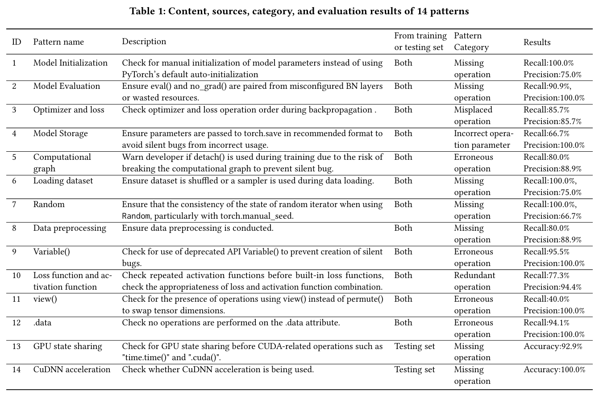

#  PYSIASSIST-artifact

This project is the code repository for our submission to SANER 2024.. Please feel free to contact us, if you have any questions.


## Empirical Results

we conducted the first empirical study to analyze the characteristics of silent bugs in PyTorch programs.

From 14,523 posts in the PyTorch forum, we selected 365 silent bug posts , All 365 silent bug posts with labeled symptoms and root causes is available [here](https://anonymous.4open.science/r/PYSIASSIST-artifact/dataset/dataset.xlsx). In addition, we have summarized 14 patterns from these silent bug posts and have developed corresponding PYSIASSIST to apply these patterns. They are available [here](https://anonymous.4open.science/r/PYSIASSIST-artifact/patterns). 

### Patterns detail



## PYSIASSIST(**Py**torch **Si**lent bug **Assisant**)

### Introduction

we developed an extensible static checker, PYSIASSIST , which is an assistant of developers, especially novice developers, to handle silent bugs in their code in the early development stage. The validation outcomes affirmed that our tool attains a precision of 93.6\% and a recall rate of 84.8\% for the existing silent bug patterns, while it demonstrates an accuracy of 95.5\% for the newly introduced silent bug patterns.  In addition to this, users can also write their own configuration files, loading them into ECSP to support the detection of patterns they need.

The Src fold includes the source code of PYSIASSIST and some commonly used APIs that have been extracted. Users can set the commonly used APIs they need to detect in the configuration file by themselves.

The Pattern fold includes 14 PYSIASSIST corresponding to 14 patterns. Users can use them to check for silent bugs corresponding to the 14 patterns.When users want to expand PYSIASSIST, they can refer to the configuration files and checker.py in these PYSIASSIST.

The dataset fold contains all 365 silent bug posts with labeled symptoms and root causes, as well as the testing code for each pattern and their detection results.

## Contributors

## Usage

To run the PYSIASSIST , following packages should be installed:

```$pip install pylint python-scalpel astor astunparse graphviz astroid```

or just use requirements.txt.

(For Windows users, if you encounter encoding errors when installing Scalpel, please switch the system to UTF-8 encoding.)

Then, if users want to use the 14 patterns, they can put the code that need to be checked into the 'Code_to_be_Checked' file in the corresponding folder, and execute the checker.py file.

For users who want to expand PYSIASSIST, they can refer to the checker.py and configured json files of the 14 patterns for configuration and combination of Subcheckers. In the future, we will develop scripts to help users fill in the configuration files.

